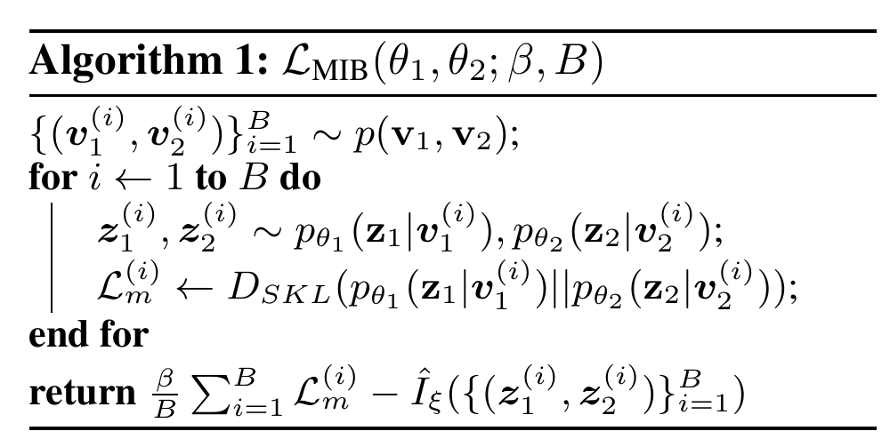
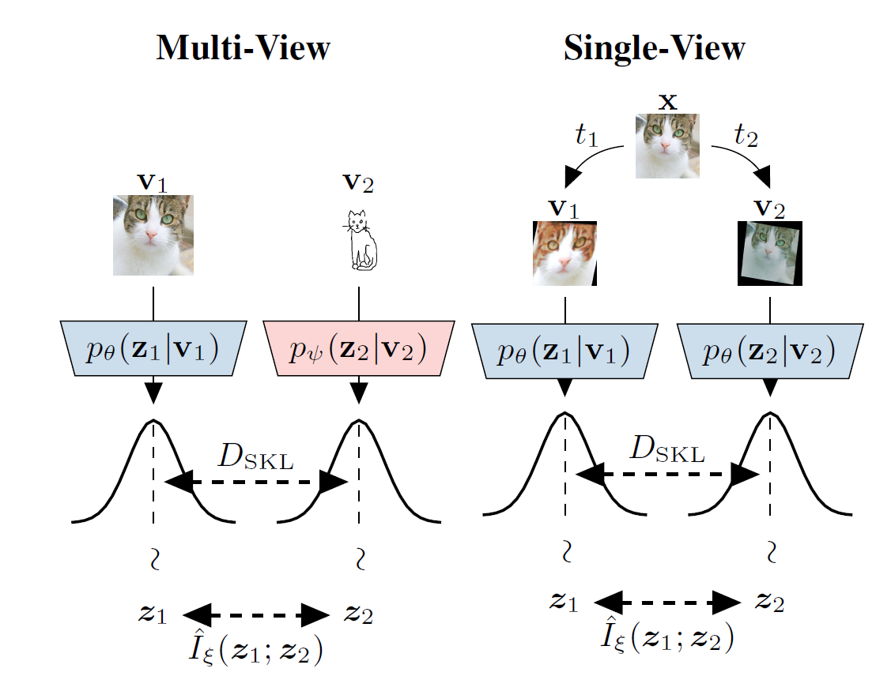
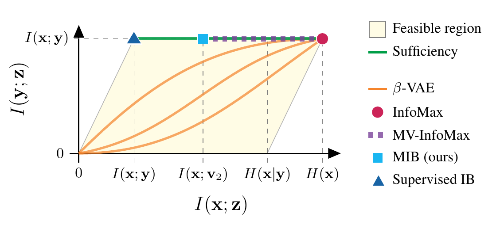
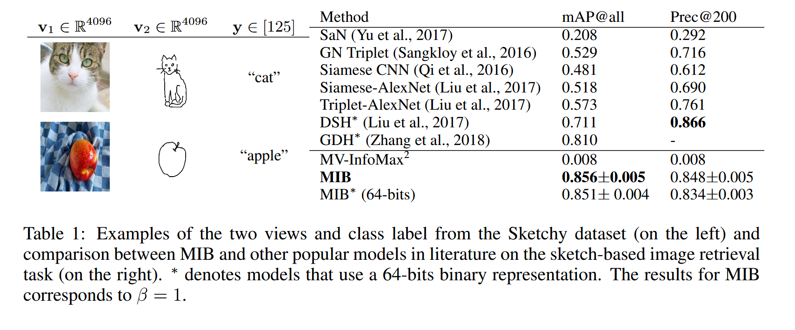
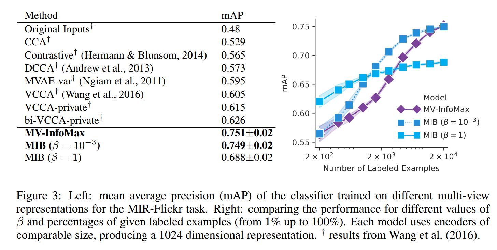
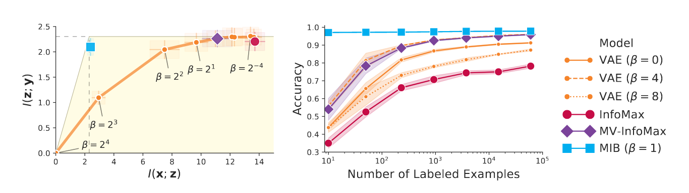

## Introduction
Information Bottleneck Principle provides an objective for learning good representations in supervised setting. however a principal assumption in this framework is availability of a target random variable $Y$. In this work authors extend the IB framework to multi-view unsupervised setting.

### Motivation
cost of acquiring labeled data is high; this has led to a renewed focus on unsupervised representation learning where the objective is to learn a representation $Z$ that is useful for a wide range of down-stream tasks where no labeled data is available.

### Information bottleneck
the main idea in IB is to find representations that are minimally sufficient for predicting $Y$.
the intuition behind minimality is as follows:
the more a representation is independent of $X$ the more it is robust to changes in $X$ and the more it is likely to generalize beyond train distribution.

#### Example:
consider a dog vs cat classification task where we are given an input image $X$ and tasked to predict the label $Y$ which corresponds to whether the input is an image of a dog or a cat. additionally assume that the training data has the following property:

cats are more likely to be photographed in indoor environments while dogs are more likely to be photographed in outdoor environments.

but this property is reversed in test distribution. now consider to models:
model 1 uses both information of background and object shape to determine the label.
model 2 only relies in object shape.
both these models are going to perform well in training data but it is obvious that model 2 is going to perform better in testing data. what separates model 2 from model 1? model 1  dependence on $X$ is less than model 2.

this objective can be formulated as follows:

$$
\textit{min } I(X,Z) \textit{ s.t. } I(Y,Z) = I(Y,X) 
$$

### Multi View Setting
in multi view setting we are provided with multiple views of an object of interest and are tasked to find representations for each view. the underlying assumption in this setting is that down-stream tasks we are interested in are invariant to the views. to make this more formal we define $X$ to be the original object of interest, $V_i$ to be a view of $X$ and $Y$ a property of interest. then:
$$
I(Y,V_1) = I(Y,V_2) = \dots = I(Y,X)
$$

Intuition for extending IB
in IB we are interested in discarding as much information contained in $X$ not useful in predicting $Y$. the multi-view assumption is that all views contain the information original view has in predicting $Y$. using this we know that information **not shared** by all views is not pertinent to $Y$ and can thus we discarded in $Z$.

## Preliminaries
for any representation $Z$ of $X$ by chain rule of mutual information we have:
$$
I(X,Y;Z) = I(Y;Z) + I(X;Z | Y)
$$
where $I(Y;Z)$ is the predictive information of $Z$ and $I(X;Z|Y)$ is the superfluous information of $Z$.
based on IB a good representation should maximize predictive information (be sufficient statistics) while minimizing superfluous information (minimality).
### Sufficiency
We define sufficiency as $I(X;Y|Z) = 0$
Proposition:
$$
 I(X;Y|Z)=0 \iff I(X;Y)=I(Y;Z)
$$

Proof:
since $Z$ is a representation of $X$ we assume $Z$ is independent of any other random variable conditioned on observing $X$:

$$
\begin{align*}
I(Y;Z|X) &= 0 \\
H(Y|X) - H(Y|Z,X) &= 0 \\
H(Y|X) - H(Y) - H(Y|Z) + H(Y) + H(Y|Z) - H(Y|Z,X) &= 0 \\
-I(Y;X) + I(Y;Z) + I(Y;X|Z) &=0\\
I(Y;X|Z) &= I(Y;X) - I(Y;Z) 
\end{align*}
$$

## Method
Definition of redundancy
 we say $V_1$ is redundant with respect to $V_2$ for $Y$ if $I(Y;V_1|V_2)=0$.

Corollary
Let $V_1$ and $V_2$ be two mutually redundant views for a target $Y$ and let $Z_1$ be a representation of $V_1$.  If $Z_1$ is sufficient for $V_2$ then $Z_1$ is as predictive for $Y$ as the joint observation of the two views.

based on the Corollary we can now extend IB to the multi-view setting. i.e. a good representation in this setting is the representation found by IB in the supervised task of predicting $V_2$ from $V_1$.

how should views be?
the more two views are different the more they are informative of what information can be discarded and hence the more we lower $I(Z_1;V_1)$. at the extreme the only shared information between views would be the label information and we show that our method reduces to traditional IB.

Formulating the objective:
note that Lagrangian of the IB objective is:
$$
\mathcal{L}(\theta,\lambda) = I(Z;X|Y) - \lambda I(Z;Y)
$$
where $Z \sim p_\theta(.|X)$. now in the setting of finding a representation for $V_1$ that is informative of $V_2$  IB objective becomes:
$$
\mathcal{L_1}(\theta_1,\lambda) = I(Z_1;V_1|V_2) - \lambda I(Z_1;V_2)
$$
symmetrically we can have:
$$
\mathcal{L_2}(\theta_2,\lambda) = I(Z_2;V_2|V_1) - \lambda I(Z_2;V_1)
$$
averaging the two losses:
$$
    \mathcal{L}(\theta_1,\theta_2,\lambda) = \frac{I(Z_1;V_1|V_2) + I(Z_2;V_2|V_1)- \lambda \biggl( I(Z_1;V_2) + I(Z_2;V_1) \biggl) }{2}
$$
this can be upper bounded by the following loss:
$$
\mathcal{L}_{MIB}(\theta_1,\theta_2,\beta) = -I(Z_1;Z_2) + \beta\ D_{SKL} (p_{\theta_1}(Z_1|V_1) || p_{\theta_2}(Z_2|V_2)) 
$$
where $D_{SKL}$ is the symmetric KL divergence defined as the average of  $D_{KL}(p_{\theta_1}(Z_1|V_1)||p_{\theta_2}(Z_2|V_2))$ and $D_{KL}(p_{\theta_2}(Z_2|V_2)||p_{\theta_1}(Z_1|V_1))$.

Intuitively this loss encourages $Z_1$ and $Z_2$ to have high mutual information and thus retain the redundancy present in $V_1$ and $V_2$ while having identical conditional distributions meaning that predicting which view has generated a given $z$ can be done no better than chance and thus $Z_1$ and $Z_2$ have discarded any view specific information.

The symmetric KL can be computed directly when $p_\theta$ s have know density and $I(Z_1;Z_2)$ can be maximized using any sample based differentiable MI lower bound like Jenson-Shannon lower bound or InfoNCE. 

A Note on Single View Setting:
what can we do when we do not have access to multiple views?
a simple solution is to come up with a set of transformations on data that we believe down-stream tasks would be invariant to. (e.g. rotation of input image in dog/cat classification example).  then we create the required multi-view dataset of our setup as follows:
1. sample transformations $t_1$ and $t_2$ randomly and independently from set of transformations $\mathbb{T}$.
2. set $V_1 = t_1(X)$ and  $V_2 = t_2(X)$.
if our assumption about these transformations is true:
$$
I(V_1;Y) = I(V_2;Y) = I(X;Y)
$$
and thus these two views are mutually redundant with respect to $Y$.

## Related Work
we employ the information plane to create a holistic view of this method and its relation to other methods of representation learning in multi-view setting.
information plane is a 2D figure where axis represent $I(X;Z)$ and $I(Y;Z)$.
based on IB a good representation should be on the top left corned of the plane.
we can view the proposed method and previous methods as points and curved in this plane:

- Supervised IB: given label $Y$ optimizing IB objective leads us to the top left corner of the plane. this representation has best predictive performance and is most generalizable.
- Infomax: based on this method good representations should have maximal mutual information with input (right most corner). $Z=X$  trivially satisfies this objective; to prevent this, different methods employ different architectural constraints on $Z=f_\theta(X)$.
- MV-Infomax: these methods are extensions of the Infomax Idea and they try to maximize $I(Z_1;Z_2)$ which can be proved to be a lower bound on $I(Z_1;V_1)$. by maximizing $I(Z_1;Z_2)$ they maintain the sufficiency property but don't put any restrictions on $I(Z_1;V_1)$ which leads to representations having different values of $I(Z_1;V_1)$ ranging from MIB to Infomax.
- $\beta$-VAE: this method finds a latent representation $Z$ that balances compression and informativeness by a hyperparameter $\beta$. the main disadvantage of this method is that informativeness is measured by $I(X;Z)$ and thus when we increase $\beta$, $Z$ becomes more compressed while trying to maintain $I(X;Z)$ but there is no explicit preference to which information about $X$ should be discarded to accomplish the compression of $Z$ and this preference is implicit in the choice of architecture. this means architectural choices can be made such that compression leads to maintaining sufficiency for $Y$ (higher curves in the figure ) or on the other hand opposite of this; such that compression leads to discarding predominantly information pertinent to prediction of $Y$ (lower curves in the figure).
- MIB: our work has the advantage of discarding information like $\beta$-VAE, but explicitly forces $Z$ to maintain sufficiency like Infomax objectives. this leads to discarding of only irrelevant information for predicting $Y$.

## Experiments (Multi View)

#### Sketch-Based Image Retrieval
Dataset. 
The Sketchy dataset consists of 12,500 images and 75,471 hand-drawn sketches of objects from 125 classes. we also include another 60,502 images from the ImageNet from the same classes, which results in total 73,002 natural object images.

Setup.
The sketch-based image retrieval task is a ranking of natural images according to the query sketch. Retrieval is done for our model by generating representations for the query sketch as well as all natural images, and ranking the image by the Euclidean distance of their representation from the sketch representation. The baselines use various domain specific ranking methodologies.  Model performance is computed based on the class of the ranked pictures corresponding to the query sketch. The training set consists of pairs of image $V_1$ and sketch $V_2$ randomly selected from the same class, to ensure that both views contain the equivalent label information (mutual redundancy).

we use features extracted from images and sketches by a VGG architecture trained for classification on the TU-Berlin dataset. The resulting flattened 4096-dimensional feature vectors are fed to our image and sketch encoders to produce a 64-dimensional representation.

#### MIR-Flickr
Dataset.
The MIR-Flickr dataset consists of 1M images annotated with 800K distinct user tags.
Each image is represented by a vector of 3,857 hand-crafted image features ($V_1$) while the 2,000 most frequent tags are used to produce a 2000-dimensional multi-hot encoding ($V_2$) for each picture.

Setup.
we train our model on the unlabeled pairs of images and tags.
Then a multi-label logistic classifier is trained from the representation of 10K labeled train images to the corresponding macro-categories.
The quality of the representation is assessed based on the performance of the trained logistic classifier on the labeled test set. 

Results.
Our MIB model is compared with other popular multi-view learning models in the above Figure. Although the tuned MIB performs similarly to Multi-View InfoMax with a large number of labels, it outperforms it when fewer labels are available.  Furthermore, by choosing a larger $\beta$ the accuracy of our model drastically increases in scarce label regimes, while slightly reducing the accuracy when all the labels are observed (see right side of Figure).
This effect is likely due to a violation of the mutual redundancy constraint.

A possible reason for the effectiveness of MIB against some of the other baselines may be its ability to use mutual information estimators that do not require reconstruction.  Both Multi-View VAE (MVAE) and Deep Variational CCA (VCCA) rely on a reconstruction term to capture cross-modal information, which can introduce bias that decreases performance.  

## Experiments (Single View)

In this section, we compare the performance of different unsupervised learning models by measuring their data efficiency and empirically estimating the coordinates of their representation on the Information Plane.

Dataset.
The dataset is generated from MNIST by creating the two views, $V_1$ and $V_2$, via the application of data augmentation consisting of small affine transformations and independent pixel corruption to each image.  These are kept small enough to ensure that label information is not effected.  Each pair of views is generated from the same underlying image, so no label information is used in this process.

Setup.
To evaluate, we train the encoders using the unlabeled multi-view dataset just described, and then fix the representation model.  A logistic regression model is trained using the resulting representations along with a subset of labels for the training set, and we report the accuracy of this model on a disjoint test set as is standard for the unsupervised representation learning literature. We estimate $I(X;Z)$ and $I(Y;Z)$ using mutual information estimation networks trained from scratch on the final representations using batches of joint samples $\{(x^{(i)},y^{(i)},z^{(i)})\}_{i=1}^B \sim p(X,Y)p_\theta(Z|X)$.

Results.
The empirical measurements of mutual information reported on the Information Plane are consistent with the theoretical analysis reported in Related word section; models that retain less information about the data while maintaining the maximal amount of predictive information, result in better classification performance at low-label regimes, confirming the hypothesis that discarding irrelevant information yields robustness and more data-efficient representations.
Notably, the MIB model with $\beta=1$ retains almost exclusively label information, hardly decreasing the classification performance when only one label is used for each data point.

### Future Work
In this work, we introduce Multi-View Information Bottleneck, a novel method 
for taking advantage of multiple data-views to produce robust representations for downstream tasks.
In our experiments, we compared MIB empirically against other approaches in the literature on three such tasks: sketch-based image retrieval, multi-view and unsupervised representation learning. The strong performance obtained in the different areas show that Multi-View Information Bottleneck can be practically applied to various tasks for which the paired observations are either readily available or artificially produced.  Furthermore, the positive results on the MIR-Flickr dataset show that our model can work well in practice even when mutual redundancy holds only approximately.

There are multiple extensions that we would like to explore in future work.  One interesting direction would be considering more than two views.  In Appendix~\ref{app:non-trans} we discuss why the mutual redundancy condition cannot be trivially extended to more than two views, but we still believe such an extension is possible.  Secondly, we believe that exploring the role played by different choices of data augmentation could bridge the gap between the Information Bottleneck principle and the literature on invariant neural networks \citep{Bloem2019}, which are able to exploit known symmetries and structure of the data to remove superfluous information.

